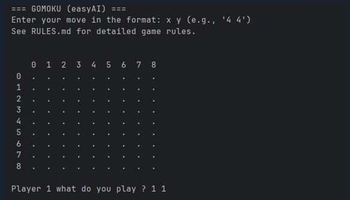

# Gomoku (Five in a Row) 

A simple and educational implementation of the **Gomoku** game using the Python library **easyAI**.  
This project demonstrates how **adversarial search algorithms** can be used to build a working game AI.

---

## Project Overview

- **Game type:** Board game – Gomoku.  
- **Players:** Human vs Computer.  
- **AI Algorithm:** Negamax with configurable search depth.  
- **Goal:** Be the first to align five of your marks (X or O) in a row — horizontally, vertically, or diagonally.  
- **Technology:** Python + easyAI + NumPy.  

---

## Game Rules

**Objective:**  
Place five of your marks in a continuous line before your opponent does.

**Rules:**
1. The game is played on a square grid (default: 9×9).  
2. Players take turns placing their marks (X for Player 1, O for Player 2).  
3. A move consists of choosing an empty cell and marking it with your symbol.  
4. The first player to align **five consecutive marks** (horizontally, vertically, or diagonally) wins.  
5. If the board is full and no one has five in a row, the game ends in a **draw**.  

---
## Environment Setup

Follow these steps to prepare your environment and run the game.

1. Install Python

2. Clone this repository

3. Install dependencies

    Install the required libraries:

    pip install -r requirements.txt

     or manually:

    pip install easyAI numpy

4. Run the game

    python gomoku_easyai.py

    You should see:
    Enter your move in the format: x y (e.g., '4 4')
    Then, simply type your moves!
    Example:
    
    4 4
    
    The AI will respond automatically.

---
## Authors
Hanna Paczoska, Wiktor Rapacz