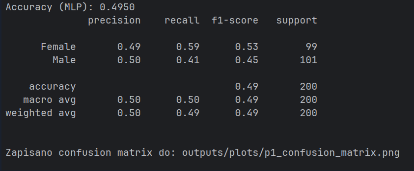
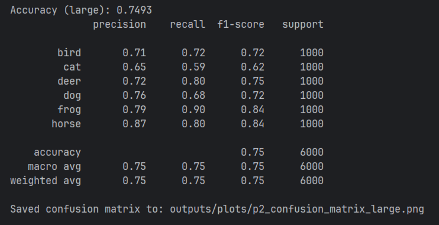
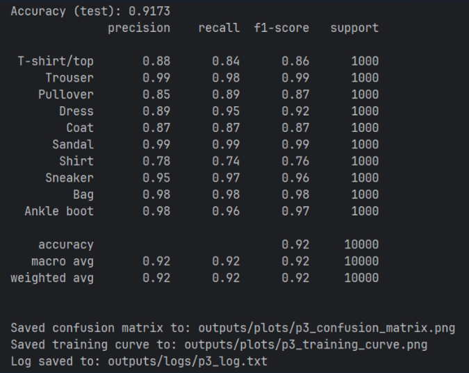
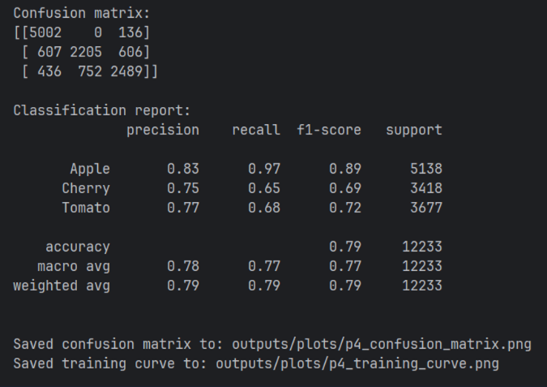

# Neural Network Project

---
## Authors
- Wiktor Rapacz
- Hanna Paczoska

---

## Project overview

The goal  of the project is to design, train and evaluate neural-network models for different
classification problems, using **one consistent framework**.

All neural networks in this repository are implemented using **TensorFlow**
with its official high-level API **Keras (`tf.keras`)**.

The project consists of four independent experiments (`p1.py` – `p4.py`),
each addressing a different classification task and dataset.

---

## Problems and solutions

### p1.py – Tabular data classification (cats dataset)
**Problem:**  
Predict the gender of a cat (Male / Female) based on tabular features
(breed, age, weight, color).

**Solution:**  
- Comparison of classic machine-learning models (Decision Tree, SVM)
  with a neural network (MLP).
- Neural network implemented using TensorFlow/Keras.
- Evaluation with accuracy, classification report and confusion matrix.

---

### p2.py – Animal image classification (CIFAR-10)
**Problem:**  
Recognize animals in images using a subset of the CIFAR-10 dataset.

**Solution:**  
- Dataset filtered to animal classes only (bird, cat, deer, dog, frog, horse).
- Two CNN architectures compared:
  - small CNN
  - large CNN
- Evaluation includes accuracy, classification report and confusion matrices
  for both models.

---

### p3.py – Clothing classification (Fashion-MNIST)
**Problem:**  
Classify images of clothing items into 10 categories.

**Solution:**  
- CNN trained on the Fashion-MNIST dataset.
- Early stopping used to prevent overfitting.
- Evaluation with accuracy, classification report, confusion matrix
  and training curve.

---

### p4.py – Custom use case: fruit classification
**Problem:**  
Design and implement a custom neural-network classification task.

**Solution:**  
- Image classification of fruits (Apples, Cherries, Tomatoes).
- CNN implemented using TensorFlow/Keras.
- Dataset is downloaded automatically by the script and not stored in the repository.
- Evaluation with accuracy, classification report, confusion matrix
  and training curve.

---

## Framework used

**TensorFlow** (version 2.x)  
Neural networks are built using **`tf.keras`**, which is an integral part of
the TensorFlow framework.

Only **one framework** is used across all exercises.

---

## Environment setup

Recommended environment (Windows / PyCharm):

1. Install **Python 3.10.x**
2. Create and activate a virtual environment:
   
   python -m venv .venv
   .venv\Scripts\activate

    Install dependencies:

pip install -r requirements.txt

Run selected scripts:

    python p1.py
    python p2.py
    python p3.py
    python p4.py

## Data sources

p1.py
Local dataset: cats_dataset.csv

p2.py
CIFAR-10 dataset (animals subset), loaded automatically via TensorFlow:
https://www.cs.toronto.edu/~kriz/cifar.html

p3.py
Fashion-MNIST dataset (Zalando Research), loaded automatically via TensorFlow:
https://github.com/zalandoresearch/fashion-mnist

p4.py
Fruits-360 – “3-body-problem” dataset (Apples / Cherries / Tomatoes):
https://github.com/fruits-360/fruits-360-3-body-problem
 (downloaded automatically by the script)

## Scenarios
### p1

### p2

### p3

### p4
